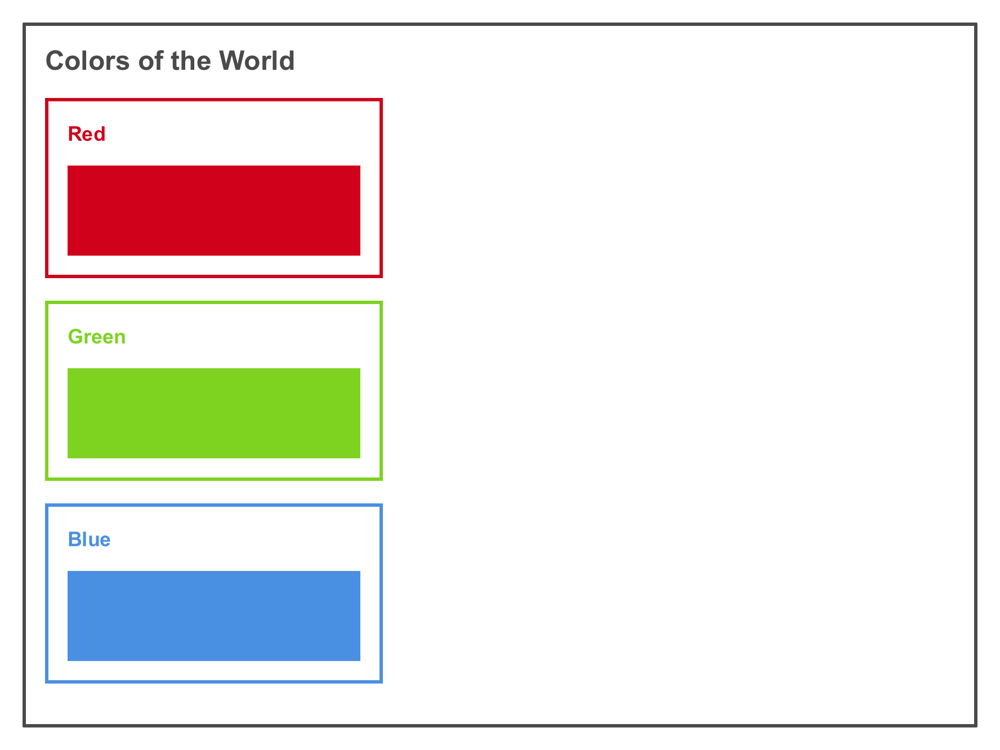

# Excavating deep with `block` elements

As you could see in the last assignment, `block`s elements such as `
`s renders with a width of 100% of its parent. That width could be changed as you did setting a value to their `width` property. But, even when their width size is small, every other `
`s were rendered above each others. That happens because of their layout. The `display: block` value makes element to behave that way.

**Let's build the colors of world!**

## Assignment

Layout a bunch of nested `
` elements matching the following picture:

**Rules:**

 - You are only allowed to use `
` elements for boxes.
 - The text “Color of the World” should be wrapped in a `<h1>` element.
 - The remaining of the texts should be wrapped in a `<h2>` element.
 - Use your imagination to give proper sizes and separations to each boxes.

### Instructions

 1. Clone this repo.
 2. Go to `assignment/02/work`.
 3. Start coding inside the file `index.html`.

When you finish with you work, upload it.
